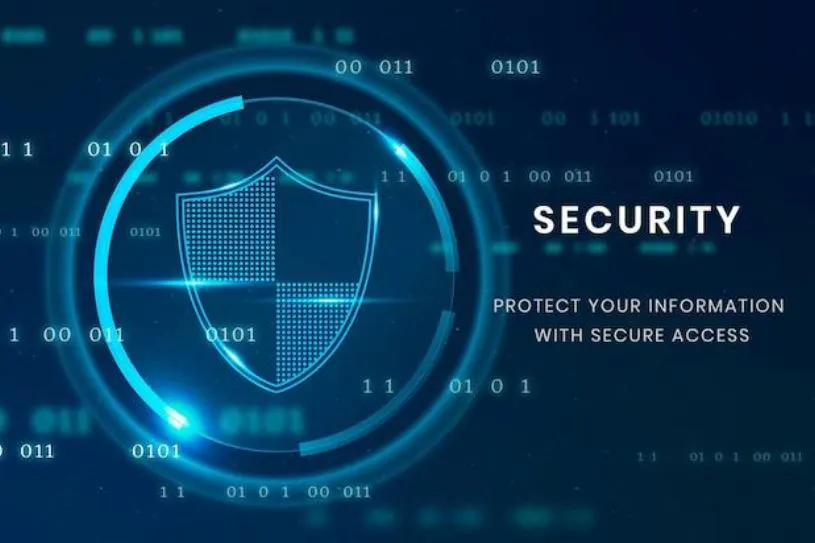

# Desinfectar Windows de Virus como Profesional

Desinfectar Windows de virus como profesional es un proceso que implica la eliminación de malware de un sistema operativo Windows. El malware puede ser una variedad de programas, como virus, troyanos, adware, spyware y ransomware.

---

## Razones por las que es Importante Analizar Windows

1. **Proteger datos y privacidad:** Los virus pueden robar datos personales como contraseñas, números de tarjetas de crédito y direcciones de correo electrónico, además de instalar malware que rastrea su actividad en línea.

2. **Evitar ralentizaciones o bloqueos:** Los virus consumen recursos del sistema, lo que puede hacer que su computadora se ralentice o incluso se bloquee.

3. **Prevenir infecciones por otros malware:** Los virus pueden abrir puertas traseras para que otros tipos de malware infecten su computadora.

---

## Signos Comunes de Infección en su Computadora

- Ralentización o bloqueo frecuente.
- Aparición de ventanas emergentes o anuncios inesperados.
- Corrupción o pérdida de archivos.
- Mal funcionamiento de programas.

---

## Herramientas para Analizar y Desinfectar

### Analizar Procesos con Process Explorer

[Process Explorer](https://learn.microsoft.com/en-us/sysinternals/downloads/process-explorer) es una herramienta avanzada de gestión de procesos para Windows desarrollada por Sysinternals. Permite obtener información detallada sobre los procesos en ejecución en el sistema, incluyendo información sobre los recursos que consumen.

**Pasos para Analizar Procesos con Process Explorer:**

1. **Abrir el Programa:**
   - Descarga y ejecuta Process Explorer desde [su sitio oficial](https://learn.microsoft.com/en-us/sysinternals/downloads/process-explorer).

2. **Configuración de VirusTotal.com:**
   - Dirígete a la pestaña "Options" en la barra de menú de Process Explorer.

3. **Activar Verificación en VirusTotal.com:**
   - Selecciona la opción "VirusTotal.com" en el menú desplegable.
   - Activa la opción "Check VirusTotal.com".

Con estos pasos, Process Explorer integrará la funcionalidad de VirusTotal.com, permitiéndote verificar si los procesos en ejecución en tu sistema tienen alguna clasificación de amenaza conocida. Ten en cuenta que se requiere una conexión a Internet para realizar estas verificaciones.

Esta integración proporciona una capa adicional de seguridad al analizar los procesos en tu sistema en busca de posibles amenazas conocidas por VirusTotal.com.

---

## Analizar el Sistema con Kaspersky Rescue Disk

[Kaspersky Rescue Disk](https://www.kaspersky.es/downloads/free-rescue-disk) es una herramienta de escaneo y desinfección de Kaspersky que permite analizar y eliminar amenazas de malware en sistemas Windows. Se utiliza cuando el sistema operativo principal está comprometido y no se puede limpiar de manera efectiva mientras está en funcionamiento.

**Pasos para Utilizar Kaspersky Rescue Disk:**

1. **Descarga la Herramienta:**
   - Descarga Kaspersky Rescue Disk desde [su sitio oficial](https://www.kaspersky.es/downloads/free-rescue-disk).

2. **Crear un Medio de Arranque:**
   - Graba la imagen ISO descargada en un CD/DVD o crea un dispositivo USB de arranque.

3. **Arranca desde el Medio de Rescate:**
   - Inicia tu computadora desde el medio de rescate creado.

4. **Ejecutar el Escaneo:**
   - Selecciona la opción de escaneo completo para buscar y eliminar amenazas de malware.

5. **Sigue las Instrucciones en Pantalla:**
   - Kaspersky Rescue Disk proporcionará instrucciones detalladas durante el proceso de escaneo.

6. **Desinfección y Eliminación:**
   - Desinfecta o elimina las amenazas detectadas según las recomendaciones de la herramienta.

---

## Analizar con Malwarebytes

[Malwarebytes](https://es.malwarebytes.com/) es una destacada herramienta antivirus y antimalware que brinda una protección robusta contra diversas amenazas en línea, como malware, ransomware y spyware. Ofrece funciones de escaneo rápido y profundo para detectar y eliminar amenazas, así como una protección en tiempo real para prevenir infecciones.

**Pasos para Restablecer los 14 Días de Malwarebytes:**

La versión gratuita de Malwarebytes ofrece una prueba de 14 días de su versión premium. Si necesitas extender esta prueba, sigue estos pasos:

1. **Desinstalación:**
   - Desinstala Malwarebytes desde el panel de control de Windows.

2. **Reinstalación:**
   - Descarga e instala nuevamente Malwarebytes desde [su sitio oficial](https://es.malwarebytes.com/).

3. **Inicio de la Prueba:**
   - Inicia Malwarebytes y regístrate para una nueva cuenta gratuita.

- Al realizar estos pasos, podrás disfrutar de otra prueba de 14 días de la versión premium de Malwarebytes. Es importante destacar que manipular el sistema para extender períodos de prueba puede infringir los términos de servicio del software, por lo que se recomienda respetar las políticas de uso del desarrollador.

- Malwarebytes suele ofrecer una versión de prueba de 14 días de su producto premium. Si deseas restablecer el período de prueba, puedes seguir estos pasos:

1. **Desinstalación Completa:**
   - Desinstala Malwarebytes desde el Panel de Control de Windows.

2. **Eliminar Restos:**
   - Utiliza una herramienta de desinstalación de terceros o busca y elimina manualmente cualquier resto de Malwarebytes en tu sistema.

3. **Cambiar Dirección IP:**
   - Reinicia tu router para obtener una nueva dirección IP si tu proveedor de servicios de Internet asigna direcciones basadas en DHCP.

4. **Crear Nueva Cuenta:**
   - Crea una nueva cuenta de usuario en tu sistema y utiliza esa cuenta para registrarte en Malwarebytes.

5. **Descarga e Instalación:**
   - Descarga Malwarebytes desde [su sitio oficial](https://es.malwarebytes.com/).
   - Instala Malwarebytes en tu sistema.

6. **Registro con Nueva Cuenta:**
   - Durante la instalación, regístrate con la nueva cuenta creada.

Estos pasos pueden permitirte restablecer el período de prueba de Malwarebytes. Sin embargo, ten en cuenta que esta información está sujeta a cambios y es responsabilidad del usuario cumplir con los términos y condiciones de Malwarebytes.

---

## Analizar con Malwarebytes ADWCleaner

[Malwarebytes ADWCleaner](https://es.malwarebytes.com/adwcleaner/) es una herramienta especializada diseñada para detectar y eliminar adware, programas potencialmente no deseados (PUP), barras de herramientas y otros elementos indeseados en tu sistema. Este programa se centra en limpiar y restaurar la estabilidad de tu sistema eliminando componentes no deseados que pueden afectar el rendimiento y la seguridad.

**Pasos para Utilizar Malwarebytes ADWCleaner:**

1. Descarga Malwarebytes ADWCleaner desde [su sitio oficial](https://es.malwarebytes.com/adwcleaner/).
2. Ejecuta el archivo descargado para iniciar la instalación.
3. Sigue las instrucciones del asistente de instalación.
4. Después de la instalación, ejecuta Malwarebytes ADWCleaner.
5. Haz clic en "Escanear ahora" para iniciar el análisis en busca de adware y elementos no deseados.
6. Revisa los resultados del análisis y marca los elementos que deseas eliminar.
7. Haz clic en "Limpiar y Reparar" para eliminar los elementos seleccionados.
8. Sigue las instrucciones adicionales que puedan aparecer para completar el proceso.

---

## Analizar con RKill

[RKill](https://www.bleepingcomputer.com/download/rkill/): Termina procesos maliciosos en un sistema operativo.

RKill es una herramienta diseñada para terminar procesos maliciosos en un sistema operativo. Puedes descargar RKill desde [su sitio oficial](https://www.bleepingcomputer.com/download/rkill/). Esta herramienta es útil para detener procesos que podrían ser parte de malware y preparar el terreno para análisis y desinfección adicionales en el sistema.

---

## Analizar desde Protección Antivirus y Contra Amenazas

1. Desconectar internet.
`netsh interface set interface "Conexión de área local" disabled` o `netsh interface set interface "Wi-Fi" disabled`
2. Ir a "Antivirus y Proteccion Antivirus y Contra Amenazas"  > "opciones de examen".
3. Seleccionar análisis de Windows Defender sin conexión.
4. Iniciar el análisis (se reiniciará automáticamente).
`ms-settings:windowsdefender`

---

## Restaurar la Imagen de Windows ante Cambios Inesperados

Ejecutar el siguiente comando en la línea de comandos:

`DISM /Online /Cleanup-Image /RestoreHealth`

Este comando utiliza la herramienta Deployment Image Service and Management Tool (DISM) para restaurar la imagen de Windows, lo cual puede ser útil ante cambios inesperados o problemas en el sistema.

---

## Mejores Configuraciones para Windows Defender
`ms-settings:windowsdefender`

### Configuración de Antivirus y Contra Amenazas

- **Activar Todo:** Ve a "Seguridad de WindowsAntivirus y Contra Amenazas > "Configuración de Antivirus y Contra Amenazas" y activa todas las opciones disponibles.

##### Configuración de Notificaciones

- **Activar Todo:** En "Seguridad de Windows" > "Configuración de Antivirus y Contra Amenazas" > "Cambiar Configuración de Notificaciones," activa todas las opciones disponibles.

##### Protección contra Ransomware

- **Activar:** En "Seguridad de Windows" > "Protección Antivirus y Contra Amenazas" > "Protección contra Ransomware," activa la protección (configura la configuración de carpetas protegidas según tus necesidades).

##### Opciones de Examen

- **Activar Examen Completo:** En "Seguridad de Windows" > "Protección Antivirus y Contra Amenazas" > "Opciones de Examen," activa la opción de "Examen Completo."

### Configuración de Protección contra Vulnerabilidades

**Seguridad de Windows:**
- **Configuración de Protección contra Vulnerabilidades:**
  - Activar todas las opciones.
  - Usar valor predeterminado (activado).
  - Opción: Forzar selección aleatoria de imagen.
    - Configuración predeterminada.

**Seguridad del Dispositivo:**
- **Aislamiento del Núcleo:**
  - Activar (solo si el procesador es compatible con esta opción).

---

## Desinfectar con Tron Script 

### ¿Qué es Tron Script?

Tron Script es un script gratuito y de código abierto diseñado para eliminar malware de computadoras con Windows. Es un script complejo que utiliza una variedad de herramientas y técnicas para eliminar incluso el malware más persistente.

### Etapas de Tron Script

Tron Script se divide en ocho etapas, cada una de las cuales se centra en una tarea específica:

1. **Preparación:** Prepara la computadora para el proceso de limpieza.
2. **Escaneo:** Escanea la computadora en busca de malware.
3. **Eliminación:** Elimina el malware detectado.
4. **Reparación:** Repara los daños causados por el malware.
5. **Optimización:** Optimiza el rendimiento de la computadora.
6. **Registros:** Genera registros del proceso de limpieza.
7. **Fin:** Finaliza el proceso de limpieza.

### Cómo Usar Tron Script

Puedes obtener el script y obtener más información [aquí](https://www.reddit.com/r/TronScript/comments/17a8389/tron_v1206_20231017_add_automated_adwcleaner/).

1. Descarga el [script Tron](https://www.reddit.com/r/TronScript/comments/17a8389/tron_v1206_20231017_add_automated_adwcleaner/).
2. Ejecuta el script siguiendo las instrucciones proporcionadas en la documentación.
3. Sigue las ocho etapas para desinfectar y optimizar tu sistema.

---

## Otros consejos de Seguridad:

Para fortalecer la seguridad de tu red, se recomienda tomar medidas adicionales además de las configuraciones individuales en tus dispositivos. Considera las siguientes acciones como parte de una estrategia integral de seguridad:

**Pasos Recomendados:**
1. **Reinicio Periódico del Router:**
   - Reinicia tu router cada cierto tiempo para eliminar posibles amenazas persistentes y mejorar el rendimiento de tu red.

2. **Restauración a Estado de Fábrica:**
   - Ocasionalmente, realiza una restauración completa del router a su estado de fábrica. Asegúrate de respaldar la configuración antes de realizar este paso, ya que restaurará todas las configuraciones a los valores predeterminados de fábrica.

3. **Mantenimiento de Actualizaciones:**
   - Asegúrate de que tanto el firmware de tu router como los dispositivos conectados estén actualizados regularmente. Las actualizaciones a menudo incluyen parches de seguridad importantes que protegen contra vulnerabilidades conocidas.

---

## Atención:

Estos pasos ofrecen configuraciones básicas para mejorar la seguridad en Windows. No obstante, es importante tener en cuenta que la afirmación de ser invulnerable contra virus o hacking al 100% es falsa. No existe una protección absoluta en seguridad informática.

Recuerda que la mejor seguridad proviene de la conciencia y la adopción de prácticas seguras en línea. A pesar de implementar diversas medidas de seguridad, no se puede garantizar una protección total en el ámbito de la seguridad informática. 

Mantente alerta, actualizado sobre las amenazas cibernéticas y realiza copias de seguridad periódicas para minimizar los riesgos.

La seguridad en línea es un esfuerzo continuo y dinámico que requiere tanto la aplicación de medidas de seguridad como la participación activa del usuario en la protección de su sistema y datos.

---

# Licencia
Este procedimiento está bajo la [licencia Creative Commons Attribution 4.0 International](https://creativecommons.org/licenses/by/4.0/). Puedes compartir, adaptar y utilizar estos pasos siempre que des el crédito correspondiente al autor original.

---

# Nota Importante
Se recomienda encarecidamente realizar una copia de seguridad de los datos importantes antes de continuar. El autor no se hace responsable de ningún daño o problema causado por el mal uso de estas técnicas.
